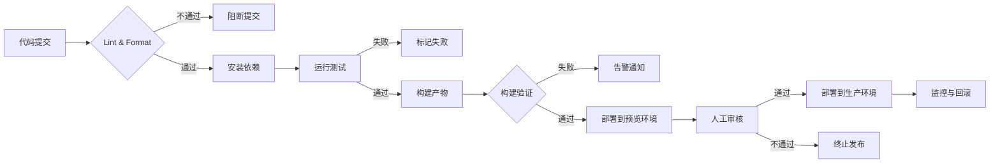

# 前端 CI/CD 最佳实践

持续集成（CI）和持续部署（CD）是现代前端工程化的核心环节。本文结合本博客项目的实际配置，总结前端 CI/CD 的完整流程与最佳实践。

## 为什么前端需要 CI/CD

| 痛点 | CI/CD 解决方案 |
|------|---------------|
| 本地构建成功，线上失败 | 统一构建环境，消除"我机器上可以" |
| 手动部署容易出错 | 自动化部署，减少人为操作 |
| 多人协作代码冲突 | 自动代码检查 + 测试门禁 |
| 回滚困难 | 每次构建都有版本，可快速回滚 |

---

## 前端 CI/CD 完整流程



### 流程说明

1. **代码提交**：开发者提交代码到 Git 仓库
2. **Lint & Format**：自动运行 ESLint、Prettier、TypeScript 类型检查
3. **安装依赖**：使用 lock 文件（pnpm-lock.yaml / package-lock.json）确保依赖一致性
4. **运行测试**：单元测试、E2E 测试、构建验证
5. **构建产物**：生成生产环境代码（dist / build）
6. **部署到预览环境**：PR 预览、分支预览
7. **人工审核**：关键节点人工确认
8. **部署到生产环境**：自动或手动触发上线
9. **监控与回滚**：上线后监控，异常时快速回滚

---

## 最佳实践清单

### ✅ 1. 锁定依赖版本

```yaml
# .github/workflows/deploy.yml
- run: pnpm install --frozen-lockfile
```

使用 `--frozen-lockfile` 确保 CI 环境与本地完全一致，避免"依赖升级导致构建失败"。

### ✅ 2. 缓存加速

```yaml
- name: Setup pnpm cache
  uses: actions/cache@v4
  with:
    path: ${{ env.STORE_PATH }}
    key: ${{ runner.os }}-pnpm-store-${{ hashFiles('**/pnpm-lock.yaml') }}
```

缓存 node_modules / pnpm store，可将安装时间从 2 分钟缩短到 10 秒。

### ✅ 3. 构建验证

不要只验证"构建是否成功"，还要验证产物是否完整：

```js
// scripts/verify-build.js
const requiredFiles = [
  'index.html',
  'feed.rss',
  'sitemap.xml',
  'pagefind/pagefind.js'
]
```

> 本项目实际配置：[scripts/verify-build.js](https://github.com/HhCompile/blog/blob/main/scripts/verify-build.js)

### ✅ 4. 使用 LTS 版本的 Node

```yaml
- uses: actions/setup-node@v4
  with:
    node-version: 20   # 使用 LTS，不要用 EOL 版本
```

Node 16 已于 2023 年 9 月停止维护，生产环境务必使用 LTS 版本。

### ✅ 5. 最小权限原则

```yaml
permissions:
  contents: write
  pages: write
  id-token: write
```

只给 CI 必要的权限，降低安全风险。

### ✅ 6. 部署前预览

对于静态站点，每个 PR 自动生成预览链接，方便团队成员审核：

```yaml
- name: Deploy Preview
  uses: peaceiris/actions-gh-pages@v4
  with:
    github_token: ${{ secrets.GITHUB_TOKEN }}
    publish_dir: ./dist
```

---

## 本项目 CI/CD 实战配置

本博客项目使用 **GitHub Actions + GitHub Pages** 实现全自动部署：

### 工作流文件

> 实际配置：[.github/workflows/deploy.yml](https://github.com/HhCompile/blog/blob/main/.github/workflows/deploy.yml)

### 配置亮点

| 配置项 | 说明 |
|--------|------|
| `actions/checkout@v4` | 最新版，修复了旧版的安全漏洞 |
| `actions/setup-node@v4` | Node 20 LTS |
| `pnpm/action-setup@v3` | 官方 pnpm 安装器 |
| `actions/cache@v4` | pnpm store 缓存 |
| `peaceiris/actions-gh-pages@v4` | 部署到 GitHub Pages |

### 触发条件

```yaml
on:
  push:
    branches:
      - main   # 只有 main 分支 push 才触发部署
```

---

## 常用工具推荐

| 工具 | 用途 | 链接 |
|------|------|------|
| **GitHub Actions** | CI/CD 流水线 | https://github.com/features/actions |
| **Vercel** | 前端托管 + 预览部署 | https://vercel.com |
| **Netlify** | 静态站点托管 | https://netlify.com |
| **Cloudflare Pages** | 边缘部署 | https://pages.cloudflare.com |
| **Docker** | 容器化构建 | https://docker.com |
| ** semantic-release** | 自动版本发布 | https://semantic-release.gitbook.io |

---

## 总结

前端 CI/CD 的核心目标：**让每次代码提交都能安全、快速地到达用户手中**。

关键原则：
1. **自动化一切能自动化的** — 构建、测试、部署
2. **失败快速反馈** — Lint → Test → Build，层层门禁
3. **环境一致性** — lock 文件 + 容器化
4. **可回滚** — 每次部署都是独立的，出问题一键回滚

> 参考阅读：[GitHub Actions 官方文档](https://docs.github.com/cn/actions) | [VitePress 官方文档](https://vitepress.dev/zh/)
